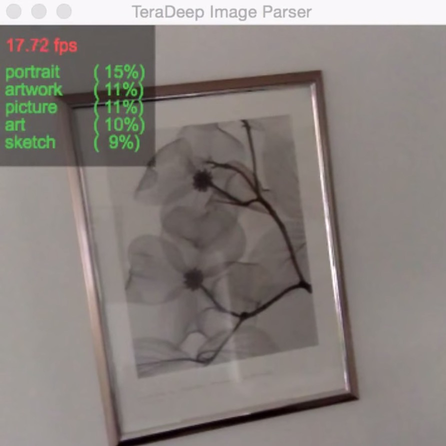

# Teradeep Demonstration application

This is Teradeep may 2015 top neural network for large-scale object recognition. It has been trained to recognize most typical home indoor/outdoor objects in our daily life. It can serve as good pair of eyes for robotits, drones and other autonomous machines.

<!--[]-->
<a href="icon"></a>

See it in action in this [video #1](https://www.youtube.com/watch?v=_wXHR-lad-Q), and also this other [video #2](https://www.youtube.com/watch?v=B0TreumQO-0).

This application is for tinkerers, hobbiest, researchers, evaluation purpose, non-commercial use only.

It has been tested on OS X 10.10.3


## install:
Install Torch7: http://torch.ch/

Please download files: `model.net`, `categories.txt` and `stat.t7` from https://www.dropbox.com/sh/qw2o1nwin5f1r1n/AADYWtqc18G035ZhuOwr4u5Ea?dl=0


## run:
To run with a webcam and display on local machine: ```qlua run.lua```

Zoom window by 2 (or any number): ```qlua run.lua -z 2```


## usage:

Feel free to modify and use for all you non-commercial projects. Interested parties can license this and other Teradeep technologies by contacting us at `info@teradeep.com`

## most importantly:

Have fun! Life is short, we need to produce while we can!

E.